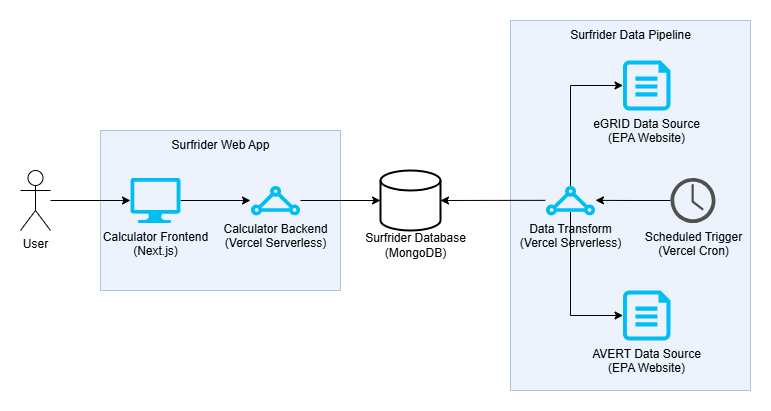

# Technical Overview

# Overview

Surfrider SLO aims to leverage collected metric data on renewable energy sources, climate change impacts, temperature trends, e-grid usage, and other related factors to forecast the human mortality impacts associated with renewable versus nonrenewable energy use. The organization seeks to translate these data points into an actionable model that highlights the benefits of renewable energy adoption.

Additionally, Surfrider SLO intends to present this information through an interactive and accessible web platform, enabling users to visualize the direct environmental, economic, and societal benefits of combating climate change and transitioning to cleaner energy solutions.

# Background

Surfrider currently has a Google Sheets-based calculator that serves as the foundation of this project. At the moment, users can enter input parameters and the spreadsheet uses formulas to calculate a table of output parameters. The goal of this project is to bring the functionality of this spreadsheet to an interactive web app, where users can better visualize the results in an accessible, responsive format.

The calculator works by combining three main components:

1. **Data Sourcing**: All calculator input data is sourced from the Environmental Protection Agency (EPA)'s [eGRID](https://www.epa.gov/egrid/download-data) and [AVERT](https://www.epa.gov/avert/avoided-emission-rates-generated-avert) databases. These datasets contain extensive metrics related to emissions, power plants, and other environmental factors. The data is refreshed yearly.

2. **Formula Evaluation**: The calculator consists of a series of pre-defined formulas based on environmental research studies. Once the calculator has both user input and EPA data, it feeds the data through these math formulas using topological sorting to handle dependencies.

3. **Visualization**: The calculator converts formula results into everyday examples that humans can better visualize, such as emissions represented as number of gas cars/year or household electricity use/year.

# Current Implementation

## Architecture Overview



The system consists of two main parts: a **Next.js web application** and **automated data pipelines**. These are connected by a **MongoDB database** that stores all EPA data required for calculations.

## Technology Stack

### Frontend
- **Next.js 15** with App Router
- **React 18** with TypeScript
- **Tailwind CSS** for styling
- **Radix UI** + **shadcn/ui** for component library
- **Chart.js** and **Recharts** for data visualization
- **React Hook Form** with **Zod** validation for form handling

### Backend
- **Next.js API Routes** (serverless functions)
- **MongoDB** with **Mongoose** ODM
- **mathjs** for formula parsing and evaluation
- **axios** for HTTP requests
- **xlsx** for Excel file processing

### DevOps & Deployment
- **Vercel** for hosting and deployment
- **Vercel Cron Jobs** for scheduled data fetching
- **GitHub Actions** for CI/CD
- **Jest** for testing
- **ESLint** + **Prettier** for code quality

## Database Schema

### MongoDB Collections

The database uses two main collections with compound indexes for efficient queries:

#### `surfrider-egrid` Collection
Stores EPA eGRID data with the following key structure:
```typescript
{
  year: number,        // Primary key (e.g., 2022)
  location: string,    // Secondary key ("US", state abbreviation, or subregion)
  // 100+ emission rate fields (see src/schema/egrid.ts for complete schema)
  annualCo2TotalOutputEmissionRateLbMwh: number,
  nameplateCapacityMw: number,
  // ... many more emission and capacity fields
}
```

#### `surfrider-avert` Collection
Stores EPA AVERT avoided emissions data:
```typescript
{
  year: number,                    // Primary key (e.g., 2023)
  location: AvertLocation,         // Secondary key (regional designations)
  powerPlantClass: PowerPlantClass, // Tertiary key (OnshoreWind, OffshoreWind, etc.)
  avoidedCo2EmissionRateLbMwh: number,
  avoidedNoxEmissionRateLbMwh: number,
  capacityFactorPercent: number,
  // ... additional avoided emission fields
}
```

## Data Pipeline

### Automated Data Fetching

**Cron Schedule**: Both eGRID and AVERT data fetchers run weekly on Fridays at 5pm UTC via Vercel cron jobs.

#### eGRID Data Pipeline (`/api/egrid`)
1. Downloads latest Excel file from EPA eGRID website
2. Processes three worksheets: US22 (national), SRL22 (subregions), ST22 (states)
3. Transforms each row into MongoDB documents
4. Stores records covering national, state, and subregion data
5. **Authentication**: Protected by `CRON_SECRET` environment variable

#### AVERT Data Pipeline (`/api/avert`)
1. Downloads AVERT Excel files for each power plant class
2. Processes regional avoided emission rates
3. Stores data indexed by year, location, and power plant class
4. **Authentication**: Protected by `CRON_SECRET` environment variable

## API Design

### Calculator Endpoint: `POST /api/calculate`

**Input Schema** (validated with Zod):
```typescript
{
  installedCapacity: number,     // MW capacity (> 0)
  powerPlantClass: PowerPlantClass, // OnshoreWind, OffshoreWind, UtilityPV, etc.
  location: EgridLocation,       // State/region code
  capacityFactor: number,        // 0-1 range
  population2070: number,        // Integer > 0
  startYear: number,            // 2015-2099
  lifeTimeYears: number,        // Integer >= 1
  yearOfStudy: number,          // 2015-2099
}
```

**Output Schema**:
```typescript
Record<FormulaId, number | null>  // Map of formula IDs to calculated values
```

**Processing Flow**:
1. Validate input parameters using Zod schemas
2. Fetch relevant eGRID record (by year/location)
3. Fetch relevant AVERT record (by year/location/powerPlantClass)
4. Initialize FormulaParser with combined data
5. Add all formulas and evaluate using topological sort
6. Return filtered results containing only valid formula IDs

## Formula System

### Formula Structure
Each formula is defined with this interface:
```typescript
type Formula = {
  id: FormulaId,           // Unique identifier from enum
  name: string,            // Human-readable name
  explanation: string,     // Description of what it calculates
  assumptions: string[],   // List of assumptions made
  sources: string[],       // Data sources and references
  expression: string,      // Mathematical expression (mathjs syntax)
  unit: string,           // Unit of measurement
  setupScope: () => void, // Function to add custom variables
  dependencies: FormulaDependency[], // List of required inputs
}
```

### Formula Evaluation Engine

The `FormulaParser` class (`src/formulas/formula-parser.ts`) handles:
- **Dependency Resolution**: Uses topological sorting to determine evaluation order
- **Cycle Detection**: Prevents infinite loops in formula dependencies
- **Variable Management**: Maintains scope of all input and calculated variables
- **Error Handling**: Validates dependencies and catches evaluation errors

**Evaluation Process**:
1. Add input variables (user inputs + eGRID + AVERT data)
2. Add all formula definitions
3. Build dependency graph and perform topological sort
4. Evaluate formulas in dependency order using mathjs parser
5. Return all calculated values

## Frontend Architecture

### Page Structure
- **`/`**: Calculator input form and results display
- **API routes**: All backend functionality in `/api` directory

### Component Hierarchy
```
Calculator (src/components/calculator.tsx)
├── CalculatorForm (src/components/calculator-form.tsx)
└── Results Components (src/components/results/)
    ├── Primary Results (emissions, energy data)
    ├── Secondary Results (equivalencies, comparisons)
    └── Visualizations (charts, graphs)
```

### State Management
- **React Hook Form**: Form state and validation
- **SWR**: Data fetching and caching for API calls
- **React Context**: Error handling and loading states

### Error Handling
- **Zod validation**: Input validation with detailed error messages
- **API error responses**: Structured error handling with proper HTTP codes
- **Loading states**: Spinner components during calculations

## Environment Variables

Required environment variables for deployment:

```bash
# Database
MONGO_URI=mongodb://...              # MongoDB connection string

# Cron Jobs Security
CRON_SECRET=your-secret-key         # Protects automated data fetching endpoints
```

**Note**: These must be configured in:
- Local `.env` file for development
- Vercel dashboard for production deployment
- GitHub Secrets for CI/CD pipeline

## Development Setup

### Prerequisites
- Node.js 18+
- MongoDB database (local or cloud)
- Git

### Quick Start
```bash
# Clone repository
git clone <repo-url>
cd surfrider

# Install dependencies
npm install

# Set up environment variables
cp .env.local.example .env.local
# Edit .env with your MongoDB URI and CRON_SECRET

# Run development server
npm run dev
```

### Available Scripts
```bash
npm run dev          # Start development server with Turbopack
npm run build        # Production build
npm run start        # Start production server
npm run test         # Run Jest tests with coverage
npm run lint         # Check code quality
npm run lint:fix     # Auto-fix linting issues
npm run format       # Format code with Prettier
```

### Testing
- **Test Coverage**: 80% minimum threshold for branches, lines, functions, statements
- **Test Framework**: Jest with React Testing Library
- **Mocked Dependencies**: External API calls and database operations
- **Test Files**: Located in `/test` directory mirroring `/src` structure

## Deployment

### Vercel Configuration
The project deploys automatically to Vercel with:
- **Automatic deployments**: On pushes to main branch
- **Preview deployments**: On pull requests
- **Cron jobs**: Configured in `vercel.json` for data fetching
- **Environment variables**: Set in Vercel dashboard

### CI/CD Pipeline
GitHub Actions workflow (`.github/workflows/ci.yml`):
1. **Lint check**: ESLint and Prettier validation
2. **Type check**: TypeScript compilation
3. **Test suite**: Jest tests with coverage reporting
4. **Build verification**: Next.js production build

## Performance Considerations

### Database Performance
- **Compound indexes**: On `{year, location}` and `{year, location, powerPlantClass}`
- **Connection pooling**: Mongoose connection reuse
- **Query optimization**: Specific field selection in database queries

### Frontend Performance
- **Code splitting**: Next.js automatic bundling
- **Image optimization**: Next.js Image component
- **Caching**: SWR for API response caching
- **Lazy loading**: Components and data loading as needed

### API Performance
- **Serverless functions**: Vercel edge functions for fast cold starts
- **Formula caching**: Reuse of compiled formula expressions
- **Data fetching optimization**: Parallel database queries

## Security

### API Security
- **CRON_SECRET**: Protects automated endpoints from unauthorized access
- **Input validation**: Comprehensive Zod schemas for all inputs
- **Rate limiting**: Implicit through Vercel serverless limits
- **CORS**: Next.js default CORS policies

### Data Security
- **Environment variables**: Secure storage of database credentials
- **Database access**: Connection string authentication
- **No sensitive data**: All calculations use public EPA data

## Known Limitations & Future Improvements

### Current Limitations
1. **Data synchronization**: eGRID (2022) and AVERT (2023) data years don't align
2. **Error recovery**: Limited retry logic for failed data fetches
3. **Real-time updates**: Data only refreshes weekly via cron jobs
4. **Scalability**: Single database instance without sharding

### Recommended Improvements
1. **Data alignment**: Synchronize eGRID and AVERT to same data years
2. **Monitoring**: Add application performance monitoring (APM)
3. **Caching layer**: Redis for frequently accessed calculations
4. **Error monitoring**: Sentry or similar for production error tracking
5. **Database optimization**: Read replicas for improved query performance
6. **API documentation**: OpenAPI/Swagger specifications
7. **User analytics**: Track usage patterns and calculator effectiveness

## Troubleshooting Guide

### Common Issues

**Database Connection Errors**:
- Verify `MONGO_URI` environment variable
- Check MongoDB network access settings
- Ensure connection string includes credentials

**Cron Job Failures**:
- Verify `CRON_SECRET` matches in Vercel settings
- Check EPA website availability
- Monitor Vercel function logs for errors

**Formula Evaluation Errors**:
- Check for circular dependencies in formula definitions
- Verify all required input variables are provided
- Review mathjs expression syntax

**Build Failures**:
- Ensure all TypeScript errors are resolved
- Check for missing environment variables in build environment
- Verify all dependencies are properly installed

### Monitoring & Debugging
- **Vercel Function Logs**: Check serverless function execution logs
- **Database Monitoring**: MongoDB Atlas monitoring if using cloud
- **Browser DevTools**: Frontend debugging and network inspection
- **Jest Tests**: Run test suite to identify regressions